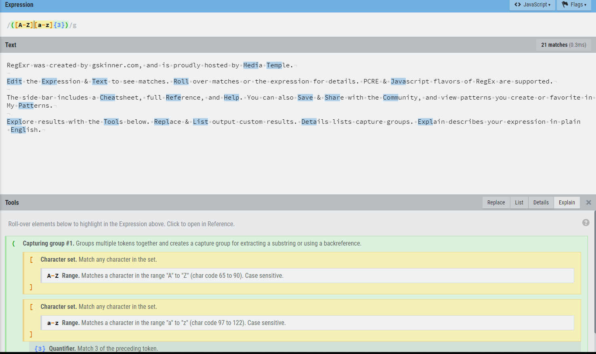
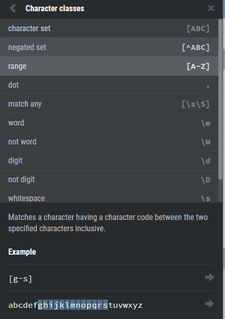

# Zaujímavé JavaScript aplikácie
- p5.js - library for creative coding
- UglifyJS - parser, minifier, compressor and beautifier toolkit
- RegExr - tool for creating, testing, and learning about Regular Expressions
## p5.js
### Ukážka aplikácie:

- https://p5js.org/examples/
- https://editor.p5js.org/

### Charakteristika:
Knižnica orientujúca sa na kreatívne programovanie. Primárne slúži na vykreslovanie objektov priamo v prehliadači. Pomocou doplnkových knižních je možné pracovať taktiež so zvukom, videom, textom, ale aj vstupom z mikrofónu alebo webkamery. Nedávno bol taktiež pridaný [editor](https://editor.p5js.org/), pomocou ktorého je možné pozorovať zmeny priamo pri úprave kódu. Pri lokálnom používaní knižnice je nutné využiť nejaký web server - napríklad node.js http-server.
## UglifyJS

### Ukážka aplikácie:
- https://github.com/mishoo/UglifyJS2
```javascript
// example.js
var x = {
    baz_: 0,
    foo_: 1,
    calc: function() {
        return this.foo_ + this.baz_;
    }
};
x.bar_ = 2;
x["baz_"] = 3;
console.log(x.calc());
```
```
$ uglifyjs example.js -c -m --mangle-props
```
```javascript
var x={o:0,_:1,l:function(){return this._+this.o}};x.t=2,x.o=3,console.log(x.l());
```
### Prepínače:
```
    -c, --compress [options]    Enable compressor/specify compressor options:
                                `pure_funcs`  List of functions that can be safely
                                              removed when their return values are
                                              not used.
    -m, --mangle [options]      Mangle names/specify mangler options:
                                `reserved`  List of names that should not be mangled.
    --mangle-props [options]    Mangle properties/specify mangler options:
                                `builtins`  Mangle property names that overlaps
                                            with standard JavaScript globals.
                                `debug`  Add debug prefix and suffix.
                                `domprops`  Mangle property names that overlaps
                                            with DOM properties.
                                `keep_quoted`  Only mangle unquoted properties.
                                `regex`  Only mangle matched property names.
    --keep-fnames               Do not mangle/drop function names.  Useful for
                                code relying on Function.prototype.name.
```
- ```-m [options]``` - povolí premenovávanie premenných, možné ďalej špecifikovať pomocou options
- ```-c [options]``` - kompresia kódu, vymazávanie whitespace
### Charakteristika:
CLI aplikácia určená na minifikovanie, kompresiu kódu. Na vstup berie súbory, ktorým napríklad upraví mená premenných na krátke názvy alebo vymaže whitespace. To čo presne chceme upraviť môžme špecifikovať napríklad pomocou RegEx.
Aplikácia obsahuje množstvo prepínačov, ktorými môžme špecifikovať napríklad list premenných, ktoré nechceme premenovať alebo nepremenovávať názvy funkcií.
Cieľom je zachovať funkcionalitu a znížiť pamäťovú veľkosť mazaním nadbytočných znakov.
### Webové alternatívy
- https://www.minifier.org
- https://javascript-minifier.com/

## RegExr

### Ukážka aplikácie:
- https://regexr.com/





### Charakteristika:
Browser aplikácia napísaná v JS/HTML, bežiaca na Node.js, umožňuje užívateľom vytvárať, ukladať, testovať regular expressions. Po zadaní regular expression sa vysvietí matching pattern na danom texte. Aplikácia taktiež rozloží nami napísany RegEx a vypíše čo daná časť matchuje.
Aplikácia obsahuje aj tutoriál na RegEx a mnoho komunitou odoslaných a ohodnotených patternov.


