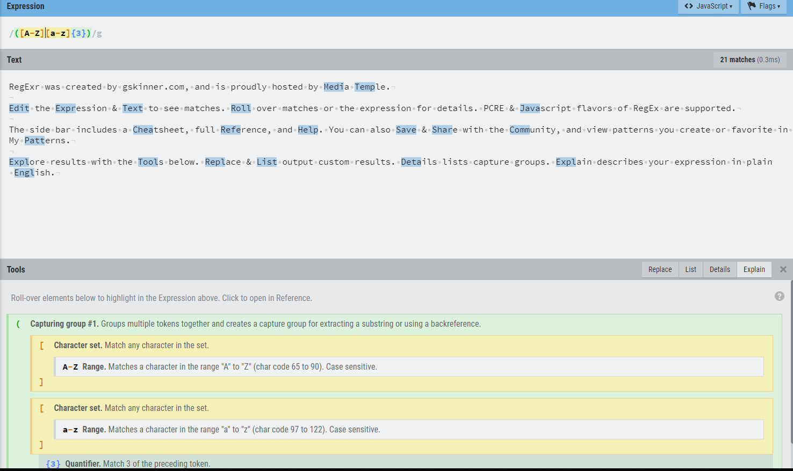
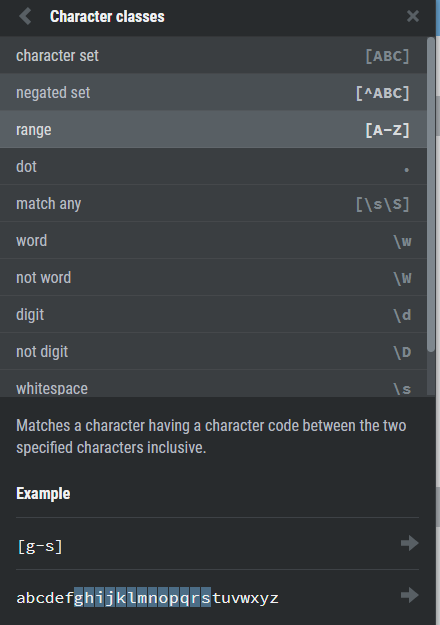

# Zaujímavé JavaScript aplikácie
- p5.js - library for creative coding
- UglifyJS - parser, minifier, compressor and beautifier toolkit
- RegExr - tool for creating, testing, and learning about Regular Expressions
## p5.js
### Ukážka aplikácie:

- https://p5js.org/examples/
- https://editor.p5js.org/

### Charakteristika:
Knižnica orientujúca sa na kreatívne programovanie. Primárne slúži na vykreslovanie objektov priamo v prehliadači. Pomocou doplnkových knižních je možné pracovať taktiež so zvukom, videom, textom, ale aj vstupom z mikrofónu alebo webkamery. Nedávno bol taktiež pridaný [editor](https://editor.p5js.org/), pomocou ktorého je možné pozorovať zmeny priamo pri úprave kódu. Pri lokálnom používaní knižnice je nutné využiť nejaký web server - napríklad node.js http-server.
## UglifyJS

### Ukážka aplikácie:
- https://github.com/mishoo/UglifyJS2
```javascript
// example.js
var x = {
    baz_: 0,
    foo_: 1,
    calc: function() {
        return this.foo_ + this.baz_;
    }
};
x.bar_ = 2;
x["baz_"] = 3;
console.log(x.calc());
```
```
$ uglifyjs example.js -c -m --mangle-props
```
```javascript
var x={o:0,_:1,l:function(){return this._+this.o}};x.t=2,x.o=3,console.log(x.l());
```
### Charakteristika:
CLI aplikácia určená na minifikovanie, kompresiu kódu. Na vstup berie súbory, ktorým napríklad upraví mená premenných na krátke názvy alebo vymaže whitespace. To čo presne chceme upraviť môžme špecifikovať napríklad pomocou RegEx. Cieľom je zachovať funkcionalitu a znížiť pamäťovú veľkosť mazaním nadbytočných znakov.
## RegExr

### Ukážka aplikácie:
- https://regexr.com/





### Charakteristika:
Browser aplikácia napísaná v JS/HTML, bežiaca na Node.js, umožňuje užívateľom vytvárať, ukladať, testovať regular expressions. Po zadaní regular expression sa vysvietí matching pattern na danom texte. Aplikácia taktiež rozloží nami napísany RegEx a vypíše čo daná časť matchuje.
Aplikácia obsahuje aj tutoriál na RegEx a mnoho komunitou odoslaných a ohodnotených patternov.


